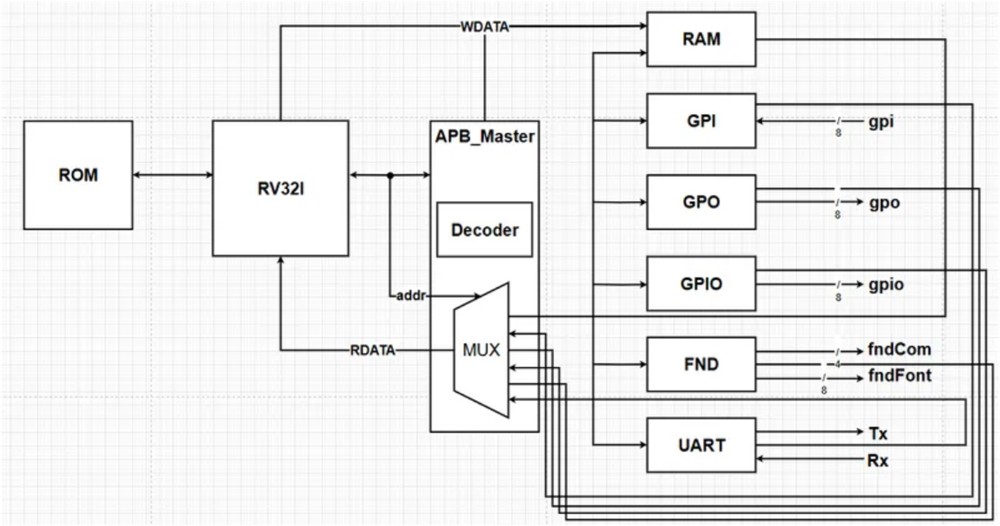
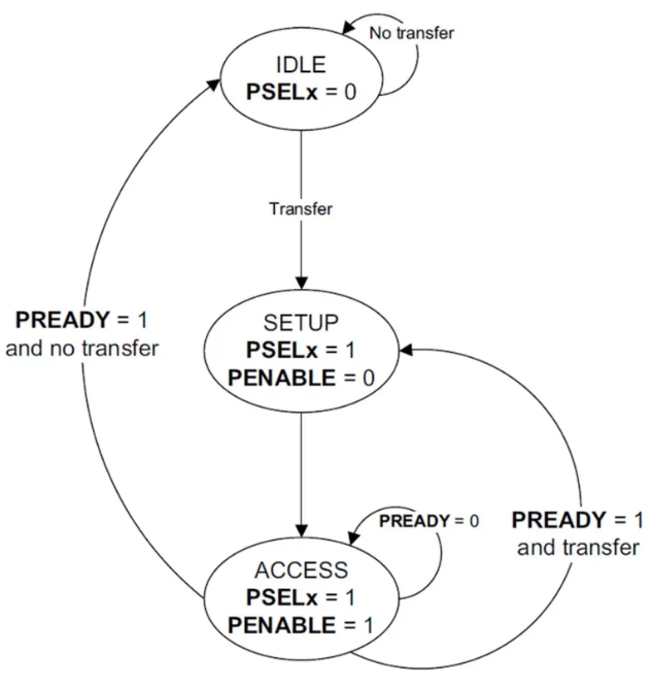
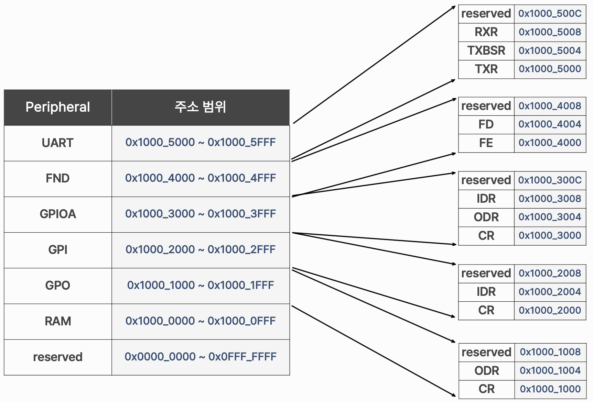
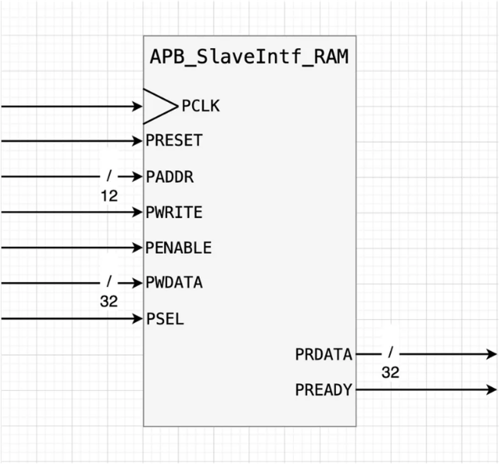
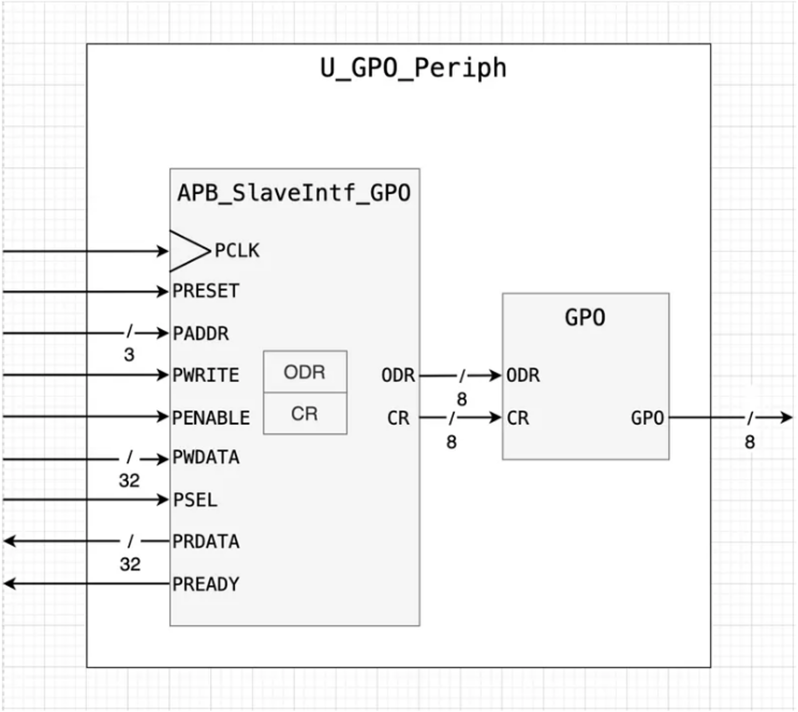
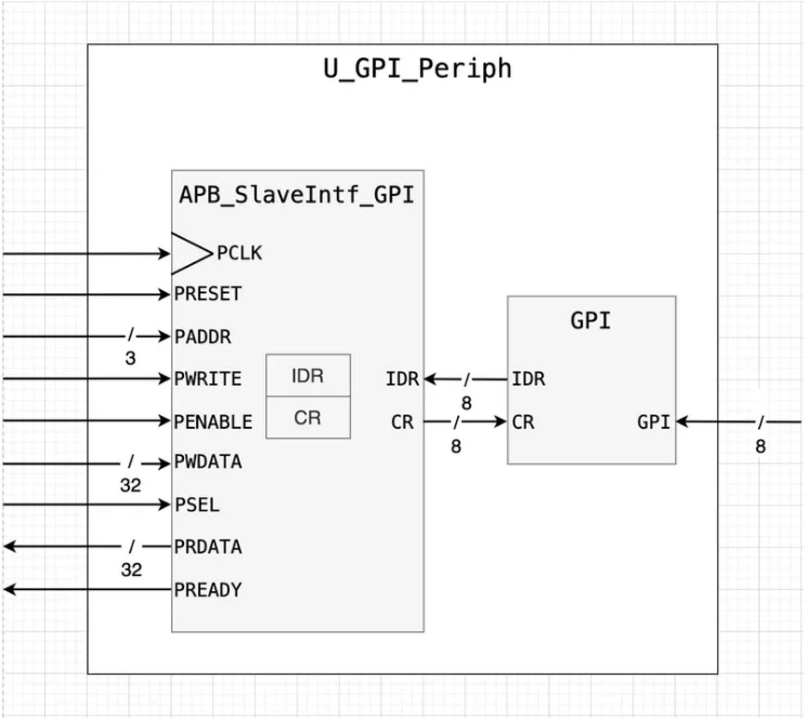
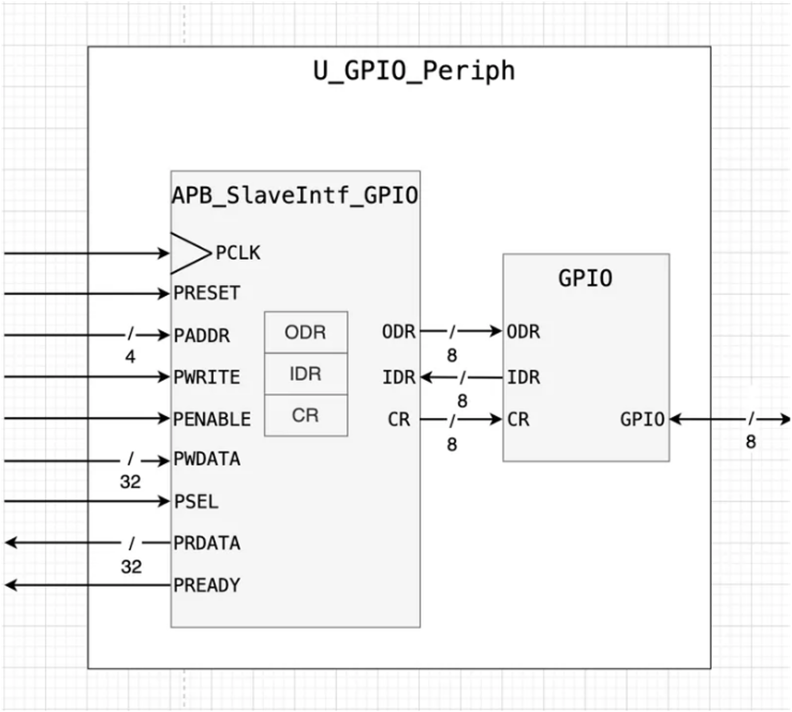
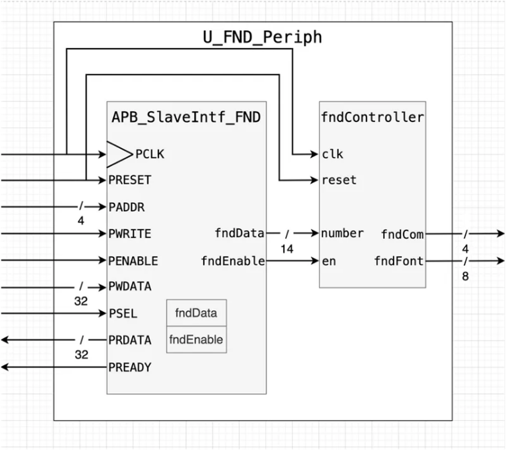
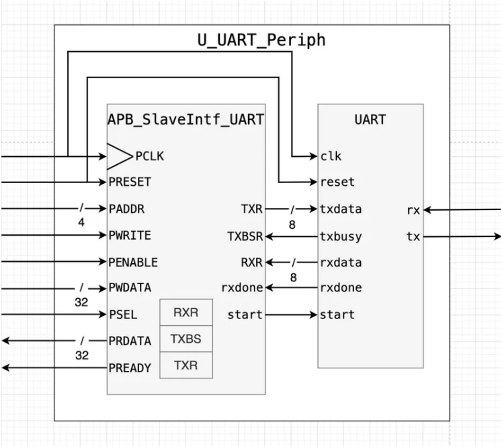
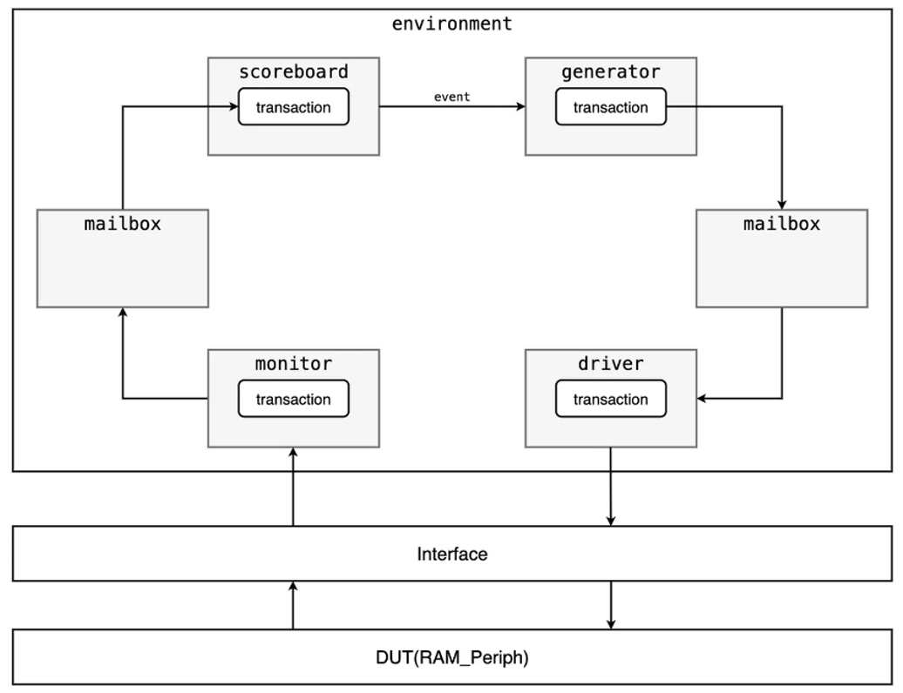

# RISC-V RV32I AMBA Peripheral BUS



## 프로젝트 개요
> 직접 설계한 RISC-V RV32I CPU에 AMBA Peripheral BUS를 기반으로 다양한 Peripheral를 추가하고자 하였습니다.
## 개발 일정

| 구분                  | 8.27 | 8.28 | 8.29 | 8.30 | 8.31 | 9.1 |
|:----:|:----:|:----:|:----:|:----:|:----:|:---:|
| AMBA APB 구조 설계     |  O  |  O  |  O  |  O  |  O  |  O  |
| RAM, GPO Peripheral  |  O  |  O  |      |      |      |     |
| GPI, GPIO Peripheral |      |  O  |  O  |  O  |      |     |
| FND Peripheral       |      |      |      |  O  | O  |     |
| UART Peripheral      |      |      |      |    | O  |  O |

## 개발 환경

|       | **TOOL** |
| :-----: | :-----: |
| **IDE**   |  |
| **Language** |   |
| **EDA**   |  |

## APB (AMBA Peripheral Bus)

```
AMBA Peripheral Bus는 ARM의 AMBA(Advanced Microcontroller Bus Architecture) 사양에 기반한 저전력, 저속 주변 장치 인터페이스  
주로 RISC-V RV32I와 같은 CPU와 주변 장치에 사용. 복잡한 파이프라이닝 없이 간단한 동기식 프로토콜을 제공한다.
```

|**Write transfer with no wait states** | **Read transfer timing diagram** |
| :---: | :---: |
|||

<div align="center">
    <br>
    State Diagram
</div>

| 신호      | 방향 | 설명 |
| :---: | :---: | :---: |
| PCLK      | 입력 | 시스템 클록 신호 |
| PRESETn   | 입력 | 비활성화 시 시스템 리셋 |
| PADDR     | 출력 | 32비트 주소 버스 |
| PSELx     | 출력 | 슬레이브 선택 신호 |
| PENABLE   | 출력 | 두 번째 및 이후 사이클에서 활성화 |
| PWRITE    | 출력 | HIGH: 쓰기, LOW: 읽기 |
| PWDATA    | 출력 | 쓰기 데이터 (PWRITE가 HIGH일 때) |
| PRDATA    | 입력 | 읽기 데이터 (PWRITE가 LOW일 때) |
| PREADY    | 입력 | 슬레이브가 전송 완료를 알리는 신호 |
| PSLVERR   | 입력 | 전송 오류를 알리는 신호 |

## Memory Map

<details>
    <summary> 📝 Memory Map</summary>
    
</details>

## Peripheral Block Diagram

<details>
    <summary> 🔖 RAM </summary>
    
</details>

<details>
    <summary> 🔖 GPO </summary>
    
</details>

<details>
    <summary> 🔖 GPI </summary>
    
</details>

<details>
    <summary> 🔖 GPIO </summary>
    
</details>

<details>
    <summary> 🔖 FND </summary>
    
</details>

<details>
    <summary> 🔖 UART </summary>
    
</details>

## SystemVerilog Verification

> SystemVerilog 기반 Verification Testbench 구조를 통해 DUT에 대한 검증을 진행하였습니다.<br>

```
Generator : 랜덤 입력 데이터(트랜잭션)를 생성
Driver : 생성된 랜덤 입력 데이터를 실제 DUT에 전달
Interface : Driver/Monitor와 DUT를 연결하는 신호 인터페이스
Monitor : DUT의 출력 동작을 관찰해서 트랜잭션 형태로 저장
Scoreboard : Monitor에서 수집한 값과 기대값(Reference Model)을 비교하여 DUT가 제대로 동작하는지 검증
Mailbox : Generator ↔ Driver, Monitor ↔ Scoreboard 사이에서 데이터를 안전하게 전달하는 통신 채널
```

<details>
    <summary> 📝 Verification Structure </summary>
    
</details>

> C 언어로 작성한 코드를 RV32I용 어셈블리어 -> 머신코드로 변환한 후, 해당 머신코드를 ROM에 탑재하여 CPU에서 정상적으로 동작하는 것을 확인하였습니다.<br>

<details>
  <summary>📝 FND C Code</summary>

  [🚀 FND C CODE](./AMBA_APB/dev03/software/peri_fnd.c)
</details>

<details>
  <summary>📝 UART C Code</summary>

  [🚀 UART C CODE](./AMBA_APB/dev03/software/peri_uart.c)
</details>


## 📽️ 동작영상

<div align="center">
  
</div>
