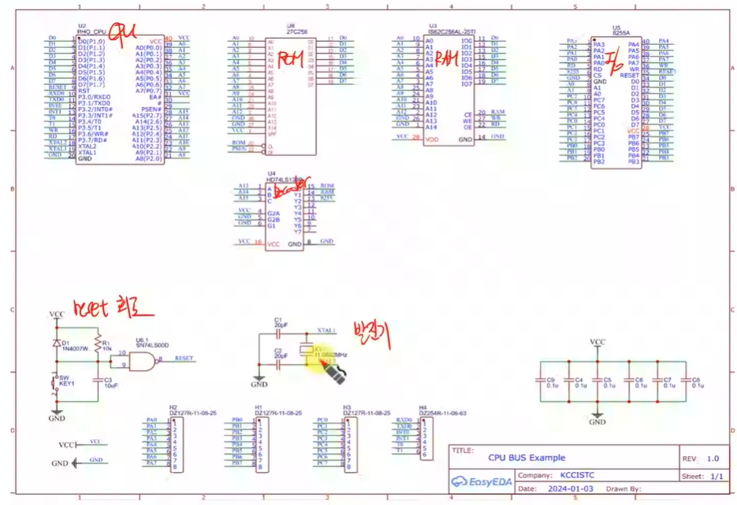
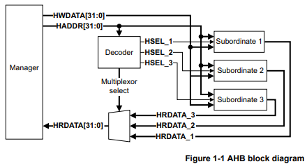
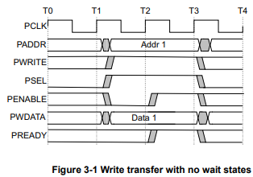
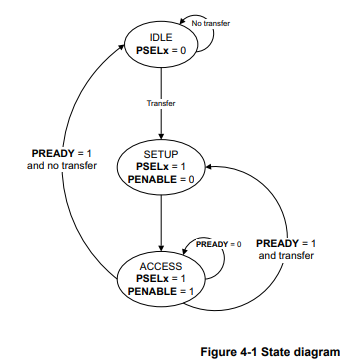
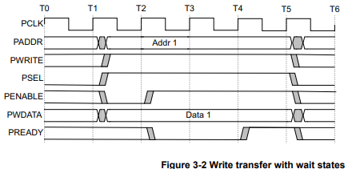

# Day 1



> **질문:** CPU와 다른 장치 간의 연결은 어떻게 하는 것이 좋을까?  
> **답변:** CPU <-> RAM, CPU <-> ROM … → **메모리 맵(Memory Map)**을 활용하여 주소 할당한다.

---

## 회로도 개념
- 같은 이름으로 연결
  - 예) CPU의 `A0` → ROM의 `A0` → RAM의 `A0` → IO의 `A0` …
- 실제 선택(Enable)은 **Decoder**가 담당한다.
- 현재 회로도에서 **Sel 신호는 Low Active**로 동작
  - ROM Select: A=0, B=0, C=0
  - RAM Select: A=1, B=0, C=0

---

## Memory Mapping
- 기준 주소 비트: `Addr = A15, A14, A13, A12`
- 주소 공간: **64KB (0x0000 ~ 0xFFFF)**

| Device | A15 | A14 | A13 | A12 | A11 | A10 | A9 | A8 | A7 | A6 | A5 | A4 | A3 | A2 | A1 | A0 | HEX     |
|:------:|:---:|:---:|:---:|:---:|:---:|:---:|:--:|:--:|:--:|:--:|:--:|:--:|:--:|:--:|:--:|:--:|:-------:|
|  ROM   | 0   | 0   | 0   | 0   | 0   | 0   | 0  | 0  | 0  | 0  | 0  | 0  | 0  | 0  | 0  | 0  | 0x0000  |
|        | 0   | 0   | 0   | 1   | 1   | 1   | 1  | 1  | 1  | 1  | 1  | 1  | 1  | 1  | 1  | 1  | 0x1FFF  |
|  RAM   | 0   | 0   | 1   | 0   | 0   | 0   | 0  | 0  | 0  | 0  | 0  | 0  | 0  | 0  | 0  | 0  | 0x2000  |
|        | 0   | 0   | 1   | 1   | 1   | 1   | 1  | 1  | 1  | 1  | 1  | 1  | 1  | 1  | 1  | 1  | 0x3FFF  |
|  8255  | 0   | 1   | 0   | 0   | 0   | 0   | 0  | 0  | 0  | 0  | 0  | 0  | 0  | 0  | 0  | 0  | 0x4000  |
|        | 0   | 1   | 0   | 1   | 1   | 1   | 1  | 1  | 1  | 1  | 1  | 1  | 1  | 1  | 1  | 1  | 0x5FFF  |
| Reserved | - | - | - | - | - | - | - | - | - | - | - | - | - | - | - | - | 0x6000~0xFFFF |

---

## 메모리 공간 요약

| 구간              | 주소 범위          | 크기  |
|-------------------|-------------------|-------|
| ROM               | 0x0000 ~ 0x1FFF   | 1 KB  |
| RAM               | 0x2000 ~ 0x3FFF   | 1 KB  |
| 8255 (I/O Device) | 0x4000 ~ 0x5FFF   | 1 KB  |
| Reserved          | 0x6000 ~ 0xFFFF   |  KB |
| **총합**          | 0x0000 ~ 0xFFFF   |  KB |

---

## 참고 계산
- 예: `(2^13 - 1) / 8 ≈ 1024 Byte = 1 KB`
- 실제 매핑된 영역 단위: **8KB 블록 단위** (주소선 A12까지 디코딩)

---

## Memory Mapped I/O

> CPU 입장에서 주변 장치(Device)는 **특정 메모리 주소 공간에 매핑된 메모리**로 바라본다.  
> 따라서 메모리에 접근하는 방식(`LOAD`, `STORE`, 포인터 연산 등)을 그대로 사용하여 I/O 장치에 접근할 수 있다.  

---

### 1. 기본 개념
- 장치 레지스터(예: 8255의 Port A, B, C, Control)는 **메모리 주소**로 접근한다.
- CPU는 ROM, RAM, I/O 주변장치를 구분하지 않고 동일한 `주소 버스 / 데이터 버스`로 접근한다.
- 디코더가 주소를 해석하여 ROM, RAM, I/O 중 하나를 선택(Chip Select)한다.

---

### 2. 예시 코드
```c
// ❌ 잘못된 경우 (Wrong case)
(int*)(0x2500) = 10;
// (int*)(0x2500)는 "0x2500 주소를 가리키는 int* 포인터"일 뿐.
// 여기서는 "포인터 변수"에 10을 대입하려고 해서 에러가 난다.

// ✅ 올바른 경우 (Correct case)
*(int*)(0x2500) = 10;
// (*) 역참조를 사용해야 0x2500 주소 공간에 직접 값을 저장할 수 있다.

// RAM 접근
*(int*)(0x2000) = 0x1234;   // RAM 특정 위치에 값 저장
int x = *(int*)(0x2000);    // RAM 특정 위치 값 읽기

// I/O 접근 (8255 Port A에 데이터 출력)
*(char*)(0x4000) = 0xFF;    // Port A에 0xFF 출력

// I/O 접근 (8255 Port B에서 데이터 읽기)
char y = *(char*)(0x4001);  // Port B의 값 읽기
```

---

## AMBA AHB

### AMBA AHB Block Diagram



---

## AMBA APB

- APB 프로토콜은 저비용 인터페이스로, 최소한의 전력 소모와 간단한 인터페이스 구조에 최적화되어 있다.
- APB 인터페이스는 **파이프라인 방식이 아니며**, **단순**하고 **동기식** 프로토콜이다. 모든 전송은 **최소 두 개의 클록 사이클**이 소요됌.
- APB 인터페이스는 주로 **주변 장치**의 제어 레지스터에 접근하기 위해 설계되었다.
  - CPU가 주변장치의 레지스터에 접근해서 Read, Write함.
- APB 주변 장치는 일반적으로 APB 브리지를 통해 메인 메모리 시스템에 연결.
  - APB 브리지 사용 X 

| Timing Diagram | Block Diagram |
| :---: | :---: |
|| |

- 쓰기 전송(Write Transfer)의 **설정 단계(Setup Phase)**는 T1에서 발생한다.
선택 신호 PSEL이 활성화되며, 이는 PADDR, PWRITE, PWDATA가 유효해야 함을 의미.

- 쓰기 전송의 **접근 단계(Access Phase)**는 T2에서 나타나며, 이때 PENABLE이 활성화된다.

- PREADY는 Completer에 의해 PCLK의 상승 에지에서 활성화되어, T3 시점에 쓰기 데이터가 수용될 것임을 표시.

- PADDR, PWDATA, 및 기타 제어 신호는 전송이 완료될 때까지 안정적으로 유지되어야 함.

- 전송이 끝나면 PENABLE은 비활성화되고, 다른 전송이 동일한 주변 장치로 발생하지 않는 한 PSEL도 비활성화.



---

## Wait Write Trans


## AMBA APB BUS 설계

